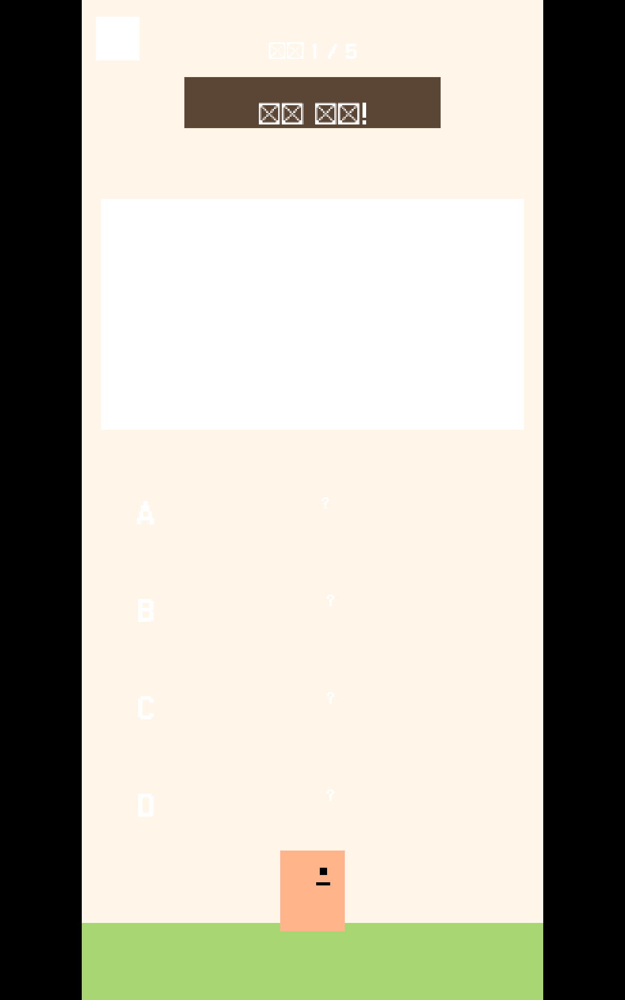
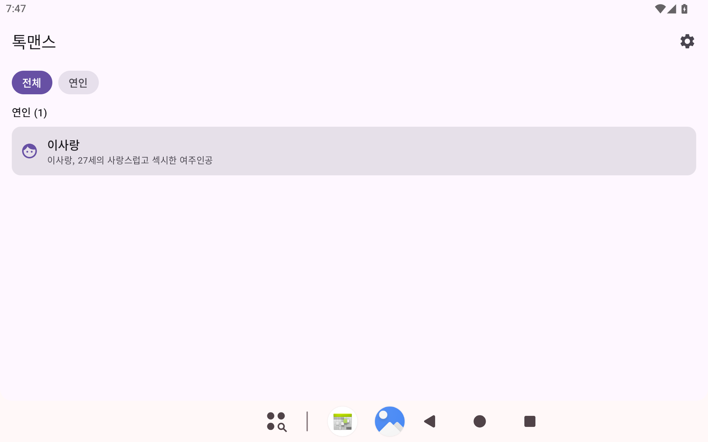

# 📖 글마을 달인 — 한국어 맞춤법 퀴즈 게임

> 매일 새로운 이야기 속에서 맞춤법 달인이 되어보세요.

[](https://github.com/BoraSarang/Wordville/releases)
[](LICENSE)
[](https://github.com/BoraSarang/Wordville/actions)

[](https://github.com/BoraSarang/Wordville/releases)
[](https://github.com/BoraSarang/Wordville/releases)
[](https://github.com/BoraSarang/Wordville)

---

## 🎮 소개

**글마을 달인**은 일상 속 상황극을 통해 한국어 맞춤법을 배우는 게임입니다.

단어를 암기하는 대신, 소설형 지문을 읽고 자연스러운 문장을 골라야 합니다.
콤보를 쌓아 EXP를 모으고, 7일 연속 플레이하면 골든패스로 보너스를 받으세요.

---

## ✨ 주요 기능

| 기능 | 설명 |
|------|------|
| 📖 **오늘의 에피소드** | 매일 새 이야기 + 5문제. 클리어하면 다음 에피소드가 열려요. |
| ⚡ **콤보 & 골든패스** | 연속 정답으로 EXP 보너스, 5콤보 +10 EXP! 7일 연속 시 첫 정답 EXP 2배. |
| 📚 **오답 복습** | 틀린 문제만 골라서 다시. 제대로 익힐 때까지. |
| 🏆 **주간 랭킹** | EXP 순위로 매주 경쟁. 내 순위를 한눈에. |
| 🎲 **퀵플레이** | 시간이 없을 때 1문제 빠르게. |
| 📦 **아카이브** | 지난 에피소드를 골라서 다시 도전. |
| 🔔 **일일 리마인더** | 매일 자정 알림으로 놓치지 않게. |

---

## 📸 스크린샷

<p align="center">
  
  &nbsp;&nbsp;
  
</p>

---

## ⬇️ 다운로드

### macOS (14.0+)

1. [최신 릴리즈](https://github.com/BoraSarang/Wordville/releases)에서 `Wordville-macos.zip` 다운로드
2. 압축 해제 후 `글마을 달인.app`을 `~/Applications/`으로 복사
3. 실행 (최초 실행 시 "열기" 확인 필요)

> ⚠️ Apple Development 인증서로 서명된 빌드입니다. 알림 기능이 동작합니다.

### Android (8.0+)

1. [최신 릴리즈](https://github.com/BoraSarang/Wordville/releases)에서 `Wordville.apk` 다운로드
2. APK 파일을 열어 설치 (출처 불명 앱 허용 필요)

> 지원 아키텍처: arm64-v8a, armeabi-v7a, x86, x86_64

---

## 🛠️ 개발环境

### 프로젝트 구조

```
Wordville/
├── server/          # Node.js + Express API 서버
├── macos/           # Swift + SpriteKit 메뉴바 앱
├── android/         # Kotlin + libGDX 게임
├── web/             # 정적 랜딩 페이지 (GitHub Pages)
├── scripts/         # 빌드/테스트/배포 스크립트
└── docs/            # PRD, DESIGN, CHANGELOG
```

### 서버

```bash
cd server
cp .env.example .env    # DATABASE_URL, JWT_SECRET 등 설정
npm install
npm run dev             # localhost:3000
```

### macOS

```bash
# Xcode 필요 (macOS 14.0+)
cd macos
xcodebuild -project Wordville.xcodeproj -scheme Wordville build

# 또는 스크립트 사용
./scripts/build_and_run.sh debug macos
```

### Android

```bash
# JDK 17 + Android SDK 필요
export JAVA_HOME=/opt/homebrew/opt/openjdk@17/libexec/openjdk.jdk/Contents/Home
cd android
./gradlew :app:assembleDebug
# APK: app/build/outputs/apk/debug/app-debug.apk
```

### 전체 빌드 & 테스트

```bash
# 서버 E2E 테스트 (서버 실행 중)
./scripts/e2e-server.sh

# 접근성 덤프
./scripts/a11y-dump.sh macos
./scripts/a11y-dump.sh android
./scripts/a11y-dump.sh server

# k6 부하 테스트 (k6 설치 필요)
./scripts/build_and_run.sh load server
```

---

## 📋 기술 스택

| 레이어 | 기술 |
|--------|------|
| 서버 | Node.js, Express, PostgreSQL (Neon), pgvector |
| macOS | Swift, SpriteKit, UserNotifications |
| Android | Kotlin, libGDX 1.14, FreeType, OkHttp |
| AI | Gemini 3.1 Flash Lite (문제 생성), Gemini Embedding (개인화) |
| 배포 | Render (서버), GitHub Pages (랜딩), GitHub Releases (앱) |

---

## 📄 라이선스

MIT License

---

## 🤝 기여

버그 리포트나 기능 제안은 [Issues](https://github.com/BoraSarang/Wordville/issues)에 남겨주세요.
